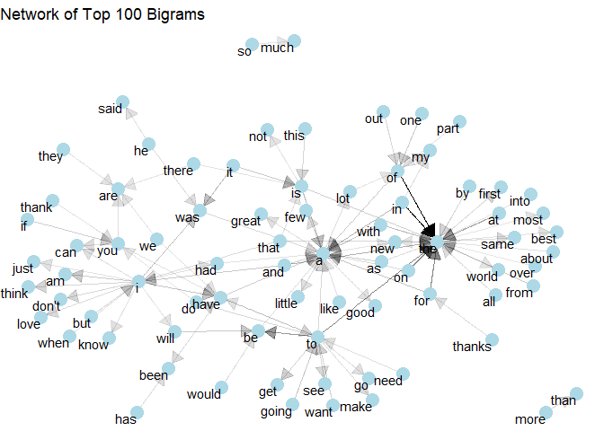
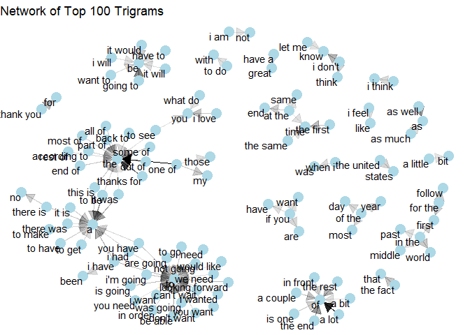
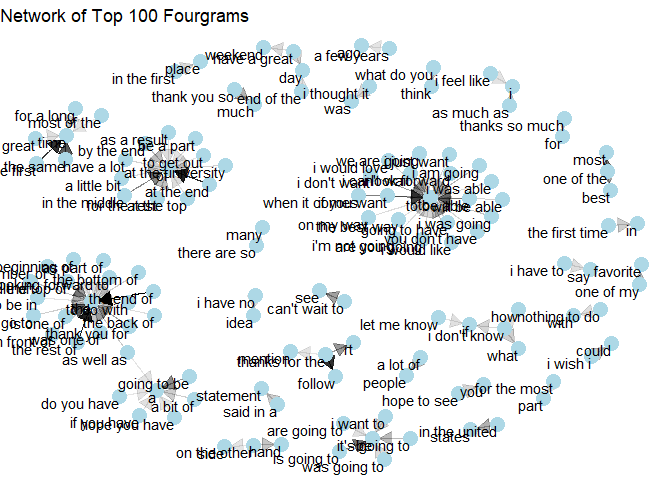
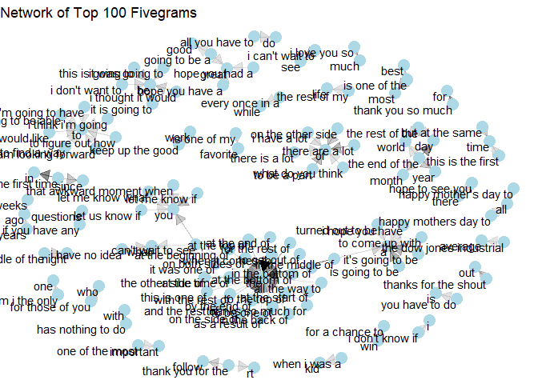

# Executive Summary

This project aims at building a word prediction model able to intelligently suggest the next word that the user is most likely to type, similar to the SwiftKey keyboard phone application. This model will be based on an existing corpus and will then be implemented into a Shiny web application.


# 1. The Corpus

The data we will be using to train such an algorithm comes from a corpus called HC Corpora. It has been collected from publicly available sources by a web crawler and checked for language. Only the English data set will be used. Our version of the data can be found [here](https://d396qusza40orc.cloudfront.net/dsscapstone/dataset/Coursera-SwiftKey.zip).

Here's a summary:


|File              |Size   |Lines     |Words       |
|:-----------------|:------|:---------|:-----------|
|en_US.blogs.txt   |200 MB |899,288   |37,546,239  |
|en_US.news.txt    |196 MB |1,010,242 |34,762,395  |
|en_US.twitter.txt |159 MB |2,360,148 |30,093,372  |
|                  |555 MB |4,269,678 |102,402,006 |

# 2. Data Preparation

The first step of our project is turn this large corpus of text into n-grams that will then be used for our algorithm. This process includes two parts:

1.  Data cleaning

2.  Tokenization

One thing to note before going further is that R uses physical memory (RAM) when working with data, which means that it is limited by how much data it can process at once. Given that our corpus is very large and that the tokenization process into n-grams is computationally intensive, we can't realistically process all of this data at once. A few solution to this problem would be to either to subset the data set into a smaller and manageable data set or maybe try to work your way around those limitations. Either solution aren't very good as the first one will reduce greatly the accuracy of our application, the other will be way too complicated.

An easier solution is to process the data onto a Spark cluster. This not only allows to process the data set faster, but also takes the load off our RAM. To do so I used the `Sparklyr` package and ran the cluster onto Google Colab as it is free and it would take the load off my computer.

## 2.1 Data Cleaning

While most natural language processing (NLP) will tokenize a corpus before cleaning/preparing it (removing stop words, stemming, etc.), our problem is quite different from a traditional NLP problem. I also found that when it comes to n-grams, it is more efficient to clean the text before tokenizing.

One more thing to keep in mind is that since we are trying to predict the next word, we need to be wary of breaks in the text, i.e. punctuation, separators and all unwanted characters. This is because we don't want to create false sequences of words as tokenization functions only work line by line, and thus would consider the word at the end of a sentence and the word at the beginning of the next as part of the same sequence even though it isn't. The method I used to deal with these breaks is to replace them with a placeholder character that can then be filtered out later.

In a nutshell this cleaning process involves:

-   Removing all non-alphanumeric, except apostrophes\*

-   Removing all digits; they aren't predictable in this context

-   Removing profanities\*\*; we don't want them to be predicted in our model

\* I kept the apostrophes so we could preserve the integrity of contractions (e.g. she's, don't), which are very common in the English language. This may as a consequence lead to preserving unwanted apostrophes, but these should be fairly minimal and shouldn't affect our model significantly. Dealing with them further would add too much complexity for the purpose of this project.

\*\* I used the `profanity_banned` list from the `lexicon` package to do so.

[*Sample code in the appendix*](#AppendixA)

## 2.2 Tokenization/N-Grams

Once the data has been cleaned, it is a simple matter of turning the text into n-grams. This involve tokenization, which is the process of dividing a string of text into its component words (tokens), then turning these tokens into n-grams, which are sequences of n words. We also need to filter out the placeholder character which we added when we cleaned the text.

For now, I have only created n-grams up to five words as more might make the model too slow.

[*Sample code in appendix*](#AppendixB)

# 3. Data Visualization

Now that our data is ready, we can have a better look at it.

## 3.1 Word Count

One way to represent n-grams is to look at at the most frequents combination of words.


We can observe that bigrams and trigrams have quite a large count of combination of common words, but as we increase the number of words with fourgrams and fivegrams, we can see more significant patterns of words forming more meaningful phrases.

## 3.2 Network diagrams

Another way to represent them is to draw them into networks that shows the relation between each combination of words.

[*Sample code in Appendix*](#AppendixC)


<!-- -->

<!-- -->

<!-- -->

<!-- -->

While it is difficult to observe, similarly to the word count, we see with the network diagrams that smaller n-grams have most common words pointing at each other and that there is not many meaningful sentences that can be made from that, but as we increase the size of the n-grams, sequences of words start converging onto a single word. This means that as the n-gram increases, the model starts detecting common phrases.

We can interpret from both of these observations that higher degree n-grams seem to be critical for our ability to predict words meaningfully.

# 4. Next Step

The next step of this project is to start building the model able to predict the next word. This involves:

-   Implementing a prediction algorithm based on a a back-off model

-   Integrating it into a Shiny web app

-   Test and optimize for performance

# Appendix

## A - Cleaning the data {#AppendixA}


```r
library(tidverse)
library(sparklyr)

alltxt <- sdf_bind_rows(spark_read_text(sc, path ="en_US.blogs.txt"),
                        spark_read_text(sc, path ="en_US.news.txt"),
                        spark_read_text(sc, path ="en_US.twitter.txt")) %>%
  sdf_with_sequential_id(id = "id")

profanity_regex <- paste0(lexicon::profanity_banned, collapse="|")

cleanedtxt <- alltxt %>%
  # Normalizing apostrophes
  mutate(line=regexp_replace(line, "''|’", "'")) %>%
  # Create a placeholder for empty character so they can be filtered out later
  mutate(line=regexp_replace(line,"[^a-zA-Z' ]"," _ ")) %>%
  # Remove apostrophes at the beginning or end of a word 
  mutate(line=regexp_replace(line," '|' |^'|'$"," _ ")) %>% 
  # Removing double spaces that might have been created
  mutate(line=regexp_replace(line,"  "," ")) %>% 
  mutate(line=tolower(line)) %>%
  # Removing profanities
  mutate(line=regexp_replace(line,profanity_regex, "_")) %>% 
  select(id, line)
```

**See `Creating ngrams.ipynb` for all codes**

## B - Creating N-Grams {#AppendixB}


```r
library(tidverse)
library(sparklyr)

toks <- cleanedtxt %>%
  ft_tokenizer(input_col="line", output_col="tokens")

bigrams <- toks %>%
  ft_ngram(input_col = "tokens", output_col = "words", n=2) %>%
  mutate(ngrams=explode(words)) %>%
  filter(!grepl("_",ngrams)) %>% 
  ft_regex_tokenizer(input_col="ngrams", output_col="split", pattern=" ") %>% 
  sdf_separate_column("split", into=c("word1", "word2")) %>%
  group_by(word1, word2) %>%
  summarise(n=n()) %>%
  filter(n>5) %>%
  arrange(desc(n))

## Same process is involved for higher degree n-grams
```

**See `Creating ngrams.ipynb` for all codes**

## C - Creating Network Graph {#AppendixC}


```r
#Graphing network bigrams
library(igraph)
library(ggraph)

set.seed(1111)
a <- grid::arrow(type = "closed", length = unit(.15, "inches"))

ngram_graph <- bigrams %>%
  graph_from_data_frame() %>%
  ggraph(layout = "fr") +
  geom_edge_link(aes(edge_alpha = n), show.legend = FALSE,
                 arrow = a, end_cap = circle(.07, 'inches')) +
  geom_node_point(color = "lightblue", size = 5) +
  geom_node_text(aes(label = name), vjust = 1, hjust = 1) +
  theme_void() +
  labs(title="Network of Top 100 Bigrams")
ngram_graph

## Same process is involved for higher degree n-grams
```

**See the .Rmd file for all codes**
