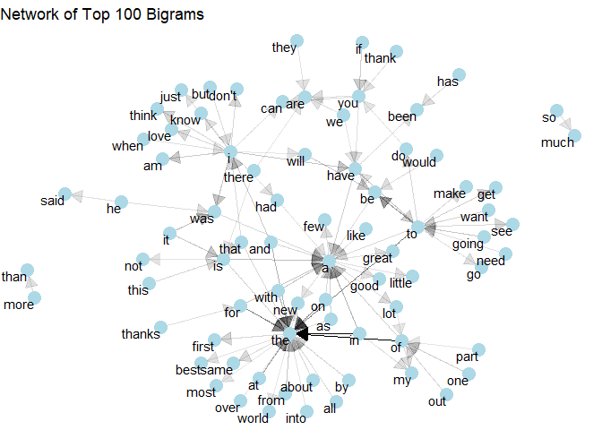
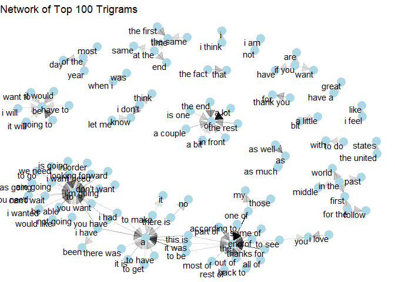
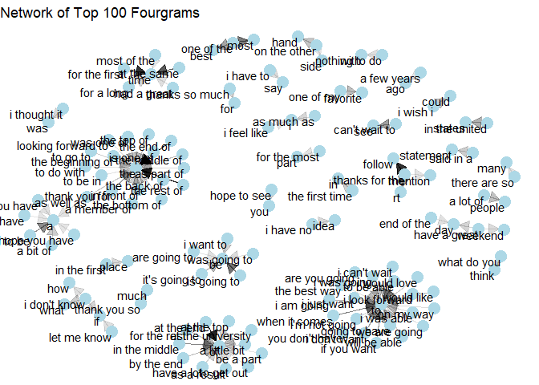
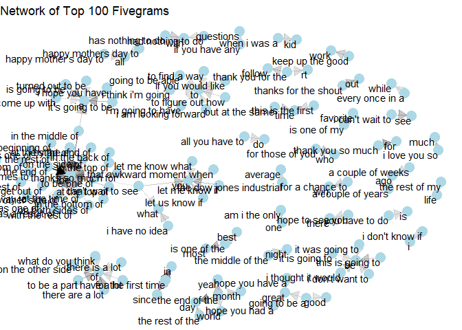

*This project was completed as part of the final deliverable of the [Coursera Data Science Specialization](https://www.coursera.org/specializations/jhu-data-science) from Johns Hopkins University.*

# Executive Summary

The goal of this project was to build a Shiny web application that is able to take a sequence of words and predict what the next word is most likely to be. To accomplish such a goal, I built a 5-gram language model using a large corpus of more than 4 million lines of text with a total count of over 100 million words, then used Stupid Backoff algorithm to predict and rank the next word. The resulting model contains more than 5 million unique n-grams and has an accuracy of 13.96 % for top-1 precision and 21.53 % for top-3 precision.

The end product can be found at the following link: [\<https://michaeln870.shinyapps.io/WordPrediction/\>](https://michaeln870.shinyapps.io/WordPrediction/){.uri}

In this report, I go through the steps taken to achieving this result, from how I used Spark to clean text and generate n-grams to selecting the right algorithm for the job.

# 1. The Corpus

The data used for this project comes from a corpora called HC Corpora. It has been collected from publicly available sources by a web crawler and checked for language. Each entry was then tagged based on the type of website it was collected from (Blogs, News or Twitter) and split into individual lines, before removing approximately 50% of it. The current version of the corpus that we will be using can be found at this [link](https://d396qusza40orc.cloudfront.net/dsscapstone/dataset/Coursera-SwiftKey.zip). Only the English data set will be used for the project, which consist of 3 files that can be summarized as follow:


|File              |Size   |Words       |Characters  |Letters     |Lines     |Avg..Word.Length |Avg..Word.Length.1 |
|:-----------------|:------|:-----------|:-----------|:-----------|:---------|:----------------|:------------------|
|en_US.blogs.txt   |200 MB |37,242,000  |206,824,000 |163,815,000 |899,000   |4.4              |41.41              |
|en_US.news.txt    |196 MB |34,275,000  |203,223,000 |162,803,000 |1,010,000 |4.75             |33.93              |
|en_US.twitter.txt |159 MB |29,876,000  |162,122,000 |125,998,000 |2,360,000 |4.22             |12.66              |
|                  |555 MB |101,393,000 |572,170,000 |452,617,000 |4,269,000 |4.46             |23.75              |

# 2. Data Preparation

The first step of our project is to turn this large corpus of text into n-grams, which are contiguous sequences of n words, then count the frequency of each one of them. This process can be divided into two parts: 1. Data cleaning and 2. Tokenization.

One thing to note before going further is that R uses physical memory (RAM) when running code, which means that it is limited by how much data it can process at once. Given that our corpus is very large and that the tokenization process into n-grams is computationally expensive, we can't realistically process all of this data at once. Instead, we have to process the data into manageable chunks and summarize the result in the end. For this project I used a Spark cluster to do so. More specifically, I used the `Sparklyr` package and ran the cluster onto Google Colab. This not only allowed to process the data set faster, but also took the load off from my own computer.

## Data Cleaning

In a nutshell the cleaning process involved the following:

-   Splitting lines into sequences of words between punctuation and separator (dots, commas, colons, parenthesis, ...), or any other unwanted characters/words.

-   Removing all non-alphanumeric, except apostrophes and hyphens inside words

-   Removing all digits

-   Removing profanities

Let's discuss these steps further.

One thing we have to keep in mind is that since we are trying to predict the next word, we need to be wary of breaks in the text, i.e. punctuation, separators and all unwanted characters, because we don't want to create false sequences of words where the last word of a sentence predicts the first word of the next. The method I used to deal with these breaks is to replace them with a placeholder character that can then be filtered out later. A better way to have dealt with them would have been to tokenize these markers and try to account for them, which would have made our model richer, but these were beyond the scope of this project.

Apostrophes and hyphens inside of words were kept so we could preserve the integrity of contractions (e.g. she's, don't), which are very common in the English language and hyphenated words (e.g. long-term, in-law) as they are words in themselves. This may as a consequence created duplicated tokens which are written differently, but mean the same thing (e.g. she's/she is). These should however be fairly minimal and shouldn't affect our model significantly.

Digits were removed because in most cases there is no way to predict them. They could have instead been replaced with a universal token (e.g. \<num\>) and accounted for in the model, but this was not very practical for this project.

Lastly, we don't want the model to predict profanities so they were simply removed. I used the `profanity_banned` list from the `lexicon` package to do so.


```r
require(tidverse)
require(sparklyr)
require(lexicon)

alltxt <- sdf_bind_rows(spark_read_text(sc, path ="en_US.blogs.txt"),
                        spark_read_text(sc, path ="en_US.news.txt"),
                        spark_read_text(sc, path ="en_US.twitter.txt")) %>%
  sdf_with_sequential_id(id = "id")

profanity_regex <- paste0(lexicon::profanity_banned, collapse="|")

cleanedtxt <- alltxt %>%
  # Normalizing apostrophes
  mutate(line=regexp_replace(line, "''|'", "'")) %>%
  # Create a placeholder for empty character so they can be filtered out later
  mutate(line=regexp_replace(line,"[^a-zA-Z' ]"," _ ")) %>%
  # Remove apostrophes at the beginning or end of a word 
  mutate(line=regexp_replace(line," '|' |^'|'$"," _ ")) %>% 
  # Removing double spaces that might have been created
  mutate(line=regexp_replace(line,"  "," ")) %>% 
  mutate(line=tolower(line)) %>%
  # Removing profanities
  mutate(line=regexp_replace(line,profanity_regex, "_")) %>% 
  select(id, line)
```

> *See `Creating ngrams.ipynb` for all codes*

## Tokenization

Once the data has been cleaned, it is a simple matter of turning the text into n-grams. This process involves tokenization, which is the process of dividing a string of text into its component words (tokens), or in our case into are sequences of n words. Once tokenized, we then have to count the frequency of each one of them and divide the n-grams into first n term(s) and last term.

In this project, I have generated n-grams up to the fifth order (fivegrams). My final model then had a corpus of 5 sizes of n-grams (unigrams, bigrams, trigrams, fourgrams and fivegrams), and each n-gram size was stored into its own dataframe. The dataframe was split into three columns: "firstTerms", "lastTerm" and "n" (frequency); except for the unigrams which only contained 2 columns: "Term" and "n". Finally, I also removed tokens with a frequency less than 3 to reduce its size.


```r
require(tidverse)
require(sparklyr)

toks <- cleanedtxt %>%
  ft_tokenizer(input_col="line", output_col="tokens")

bigrams <- toks %>%
  ft_ngram(input_col = "tokens", output_col = "words", n=2) %>%
  mutate(ngrams=explode(words)) %>%
  filter(!grepl("_",ngrams)) %>% 
  ft_regex_tokenizer(input_col="ngrams", output_col="split", pattern=" ") %>% 
  sdf_separate_column("split", into=c("word1", "word2")) %>%
  group_by(word1, word2) %>%
  summarise(n=n()) %>%
  filter(n>5) %>%
  arrange(desc(n))

## Same process is involved for higher degree n-grams
```

> *See `Creating ngrams.ipynb` for all codes*

The final model can be summarized as follows:


|Measure            |Unigrams   |Bigrams    |Trigrams   |Fourgrams  |Fivegrams |Total       |
|:------------------|:----------|:----------|:----------|:----------|:---------|:-----------|
|# unique n-gram    |212,965    |1,510,691  |2,012,844  |1,106,633  |378,469   |5,221,602   |
|Total n-gram count |98,336,689 |71,339,756 |36,394,980 |12,279,412 |3,194,251 |221,545,088 |

# 3. Exploratory Data Analysis

Now that our data is ready, we can have a better look at it.

## Word Count

One way to represent n-grams is to look at at the most frequents combination of words.


We can observe that bigrams and trigrams have quite a large count of combination of common words that don't hold much meaning, but as we increase the number of words with fourgrams and fivegrams, we can see that more meaningful patterns start to form.

## Network diagrams

Another way to represent them is to draw them into networks that shows the relation between each combination of words.


> [Sample code and bigger version of the diagrams in the appendix](#AppendixC)

While it is difficult to see the network diagrams clearly, we can still observe that smaller n-grams have mostly common words pointing at each other, while for larger n-grams sequences of words start converging onto a single word. This seems to suggest that as the n-gram size increases, common phrases starts to form more clearly.

We can thus interpret from both of these observations that higher degree n-grams seem to be critical for our ability to predict words meaningfully since less words can meaningfully continue the sequence. For instance, if we have the sequence "the end of the", we can confidently predict the word "day" as the most likely continuation given it's the 5th most popular fivegrams, however if we have have the word "of the", it become much more difficult to suggest "day". In this case, the count for "of the year" is greater in our model than the count "of the day".

# 4. The Model

## Selecting an algorithm

Now that we have our corpus of n-grams, we can start building the algorithm. The main intuition when building a word prediction model is to find the probability that a word appears given a sequence using its relative frequency count.

$$
P(fun|I\, am\, having\, a\, lot\, of) = \frac{COUNT(I\, am\, having\, a\, lot\, of)}{COUNT(I\, am\, having\, a\, lot\, of\, fun)}
$$

This general model is however limited as we can't count every sequences in the whole corpus. This is why we previously generated n-grams. The idea of having n-grams is to calculate the probability that word appears given n previous terms. To do so, there's a simple approaches we can use, such as Markov Chains and Maximum Likelihood Estimation, but these aren't very good at dealing with sequences that aren't in our model. Better approaches add some form of smoothing to the model, which is a way to distribute probability to sequences not previously seen in the model.

Smoothing techniques use is either or both backoff and interpolation. Backoff is the idea that we simply "back off" to a lower-order n-grams if there aren't sufficient evidence in the higher-order n-gram. For instance if a sequence isn't found in the trigram model, we us the bigram model, then the unigram if it isn't found again. Interpolation is the idea that we mix probabilities from all order of n-grams by weighting and combining their counts.

The most effective smoothing techniques are Katz Backoff, Kneser-Ney Smoothing and Stupid Backoff. Both Katz Backoff and Kneser-Ney smoothing rely on Good-Turing discounting. The downside of those method is that they are a bit more computationally expensive than other methods and might not work as fast with large models. Stupid Backoff on the other hand is much simpler than the previous two and is designed to work with large models. Given a very large dataset, this method can perform just as well as the more sophisticated approaches. In this project, I chose to use the Stupid Backoff approach due to its simplicity and it's speed of execution.

## Stupid Backoff

Stupid Backoff despite its name is quite effective at predicting the next word given a large enough dataset. The idea of this approach is to calculate the relative frequency of word given a sequence of words by starting in the highest order n-gram available and "backing off" to next lowest order if no match was found. We repeat this process until we find a sequence that exist in our model or we backed off to unigrams. For each back off, we discount by an amount alpha, which the recommended value is 0.4.

$$S(w_i|w^{i-1}_{i-k+1}) =  \left\{ \begin{array}{ll}
         \frac{count(w^i_{i-k+1})}{count(w^{i-1}_{i-k+1})} & \mbox{if $count(w^i_{i-k+1})>0$};\\
        \alpha S(w_i|w^{i-1}_{i-k+2}) & \mbox{otherwise}.\end{array} \right.$$

The result from this equation gives us scores, which can be interpreted in a similar way as a probability, but aren't normalized probabilities.

To illustrate how this equation works, let's imagine that our sentence is "they plotted against":

1.  We look into our fourgrams model for "they plotted against", but we find not match.

2.  We back off to our trigrams model and look for "plotted against", but we find not match again.

3.  We back off to our bigrams model and look for "against":

    1.  We find the word "the" with the highest count of 11,268, followed by the word "a" with a count of 1800, and many more words, The total occurrence count of a bigram starting with "against" is at 32,273.

    2.  We calculate their respective scores, "the" is 11,268/32,273= 0.35 and "a" with a score of 0.06.

    3.  Because we backed off twice, we apply a discount for each back off, the recommended alpha value being 0.4. The final scores is then 0.35\*0.4\*0.4=0.056 for "the" and 0.06\*0.4\*0.4=0.01 for "a".

4.  Our predicted word is then "the" with a score of 0.056. We stop looking here because we found a match.

## Implementation

The way I implemented this algorithm was very simple. I merged all n-grams models into a single list (dict) ordered from bigrams to fivegrams. I then used a decreasing loop structure to look for the given string of text into each element of that list until I found match. Then I computed the relative frequency for all matches that I stored in a new data frame.


```r
## Receives a string vector "words" [1] "of"   "this" "form"
stupid_backoff <- function(words, alpha = 0.4){ 
  
  n_words <- length(words)
  n_alpha = 0
  scores = NULL

  ## Scoring
  while(n_words>0){
    words_str <- paste(words, collapse = " ")
    ngrams <- dict[[n_words]] %>%
      filter(firstTerms == words_str) %>%
      mutate(Score = n/sum(n)*alpha^n_alpha) %>%
      select(lastTerm, Score) %>%
      rename(Term=lastTerm)
    
    scores <- bind_rows(scores, ngrams) %>%
      arrange(desc(Score)) %>%
      distinct(Term, .keep_all = TRUE)
          
    words <- words[-1]
    n_words <- n_words-1
    n_alpha <- n_alpha +1

    if(nrow(scores) != 0) {
      break
    }
  }
  return(scores)
}
```

> *In the final version I added more codes to add a recursion feature as well as being able to back off to unigrams. You can see the complete code in the `functions.R` in the App folder.*

## Benchmarking

For testing the model, I used the independent [benchmark.R](https://github.com/hfoffani/dsci-benchmark) tool made specifically for benchmarking algorithms developed for this Capstone Project. The tool test prediction accuracy based on a sample of 793 tweets and 599 blog sentences, with a total of 28,658 words. It uses the top-3 prediction from our model to calculate different measures. Here's the result for my model:


|Overall.top.3.score |Overall.top.1.precision |Overall.top.3.precision |Average.runtime |Number.of.predictions |Total.memory.used |
|:-------------------|:-----------------------|:-----------------------|:---------------|:---------------------|:-----------------|
|18.06 %             |13.96 %                 |21.53 %                 |97.18 msec      |28,464                |224.63 MB         |

These results are quite good considering the simplicity of the model and considering that they appear to be above average in comparison to other models from people having previously completed the project. Here's a [forum thread](https://www.coursera.org/learn/data-science-project/discussions/all/threads/1aWTuoCGEeakbhIiKPxV8w) for reference, though it's probably locked for people who aren't enrolled.

## Potential improvements

While the goal of this project wasn't to build a very effective word prediction model, but to demonstrate one's ability to do so, it is still important to reflect on how one could improve its model further. Some of these improvements are as follows:

-   **Add more text data to the corpus**: While our corpus was quite large, too large to be processed all at once on a home computer, the n-gram count compared to more advance models, which have billions and trillions of n-grams.

-   **Increase n-gram size**: Our highest order n-grams was 5, which is reasonable for the size of our corpus, but increasing it to 6+, might have improved our accuracy, mostly if combined with more data.

-   **Use a more accurate prediction approach**: While Stupid Backoff does almost just as well with large language models than the most effective smoothing methods, its n-grams count is quite low as mentioned in a previous point. Implementing a Kneser-Ney Smoothing or Katz Backoff instead, might improve the accuracy of the model.

-   **Add sentence segmentation**: I didn't use sentence tokenization methods as it is difficult to distinguish between a sentence-boundary marker and an abbreviation marker (e.g. Mr.). These require either an extensive dictionary of abbreviations or the use of machine learning. Instead, I segmented each sequences of words between each punctuation marker and built my model from there.

-   **Implement an open vocabulary system**: I didn't implement a system to deal with words that don't appear in my model. This would require either the use of machine learning or to build a fixed vocabulary set, then find out the probabilities that those words appear in a certain context.

-   **Add more complexity**: There is always more that we can add to a model to make it more accurate, but there is also a fine balance between accuracy and performance that we need to account for.

# 5. The application

The final application can be found at the following link: <https://michaeln870.shinyapps.io/WordPrediction/>


**How it works:**

-   Use the text box to write something and look at the prediction under.

-   Look at the table on the right to see more suggestions.

-   Scores range from 0 to 1, a higher score basically means a higher probability that the prediction is right.

**Options:**

-   **Slider**: Changes the number of suggestions displayed on the right (if the number of suggestions doesn't change, it means that there are no more suggestions).

-   **Add recursion**: Looks into lower order n-grams to give more suggestions.

-   **Add a searchable table**: Adds a searchable table below with all available suggestions.

# Appendix

## Network Graphs

> **See .Rmd file for all codes**

<!-- --><!-- --><!-- --><!-- -->
